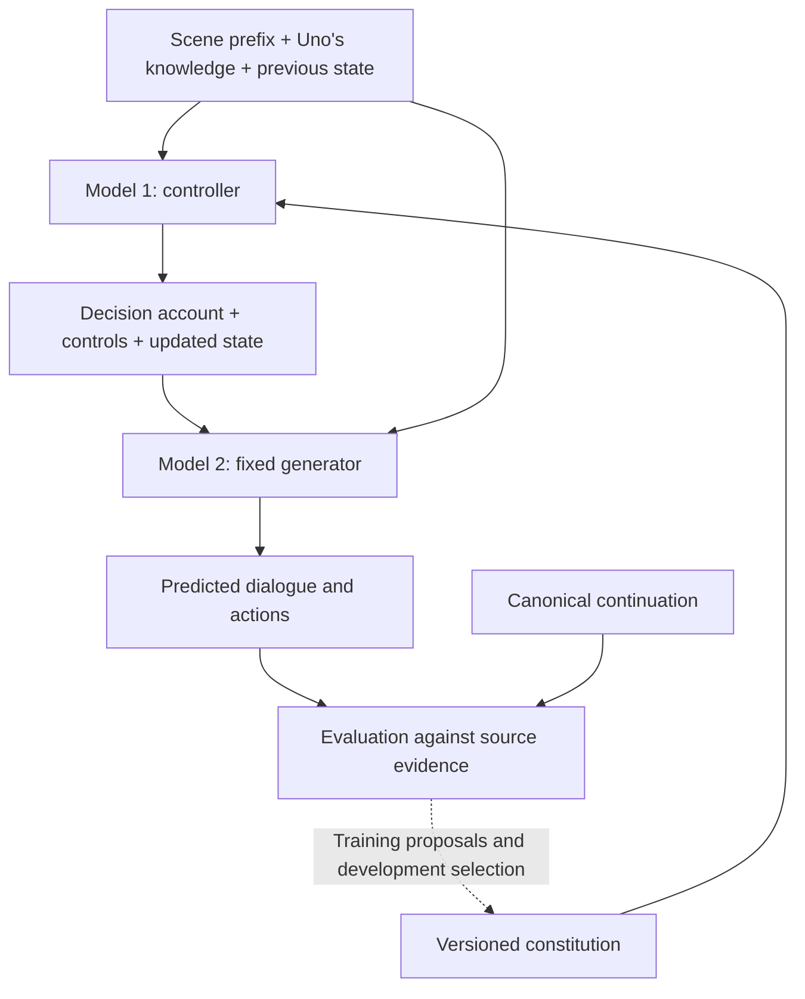

# Learning Uno's Personality Policy

Status: proposed experiment. This document specifies the implementation and
evaluation plan; the components described below have not been implemented.

Learn a stateful personality policy from the comic pages. Given what Uno knows,
who he is interacting with, their relationship, and his current state, **model 1**
selects intentions and expression controls. **Model 2** uses those controls to
produce dialogue and actions. Feedback from canonical scenes improves model 1.

Start with an LLM controller and an editable constitution. Consider distilling
the controller into a smaller model after demonstrating that the policy improves
predictions. This experiment complements the
[fine-tuning design](fine-tuning-design.md) by establishing what personality
behavior the system should learn.

## Objective and interpretation

The experiment should answer four questions:

1. Can the controller predict Uno's priorities, strategy, and expression from a
   scene prefix?
2. Can we reconstruct a supported account of his beliefs, goals, and value
   tradeoffs at each meaningful decision?
3. Does the resulting generator produce behavior compatible with the comics?
4. Do revisions driven by training failures improve predictions on other scenes?

Treat reconstructed chain of thought as a **hypothesis about the character's
decision process**. Preserve alternatives when several explanations fit. The
comics provide evidence about behavior and sometimes explicitly depicted
thoughts; they do not supply a complete, uniquely recoverable internal process.
Inferring goals and beliefs from actions resembles
[inverse planning](https://dspace.mit.edu/entities/publication/2e23673d-f720-4720-98bc-6db894ba27e1).

Success means better predictions, supported interpretations, and coherent state
transitions. It does not establish recovery of a unique personality model:
[different objectives can explain the same observed policy](https://arxiv.org/abs/2411.15951).

## Architecture



The constitution holds persistent tendencies and conditional priorities. Runtime
state holds transient emotions and evolving relationships. In multi-turn replay,
each controller call receives the previous predicted state and newly available
events. Record the canonical era so character development can be represented.

Initially, model 1's base model and prompt template remain fixed while its
constitution changes. Model 2's model, prompt, and sampling configuration also
remain fixed. An offline annotator and evaluator perform separate roles from
these runtime components.

## 1. Establish the dataset and evaluation boundary

Assign whole issues or connected story arcs to training, development, and final
test sets before deriving profiles or rules. Group adjacent decisions from the
same story together. Record the assignment and sampling seed in a manifest.

- Training scenes supply rules, examples, and failure explanations.
- Development scenes select candidate policies. Their scores are subject to
  repeated selection and are not final evidence of generalization.
- Final test scenes assess the frozen selected policy. Using their failures to
  revise the policy requires a new untouched test set for the next claim.

Build the initial constitution and static-profile baseline from training scenes.
The existing full-corpus soul document and ledger contain potential test
information, so derive experiment-specific versions with tracked provenance.
Apply the same boundary to retrieved examples and generated training data.

Select approximately 40 decisions from the training and development partitions
for the pilot. Cover different relationships, levels of trust and authority,
urgency, vulnerability, humor functions, and value conflicts. Record coverage
gaps rather than manufacturing canonical examples to fill them.

**Complete when:** the manifest assigns every selected source group to exactly
one partition, the pilot selection is documented, and the permitted sources for
policy and profile derivation are recorded.

## 2. Build decision cases with source provenance

Use the existing [scene extraction](../pkna/extract/scenes.py) and emotional page
outputs. Preserve issue, page, panel, and dialogue position before flattening
panels into scenes. A scene can produce several cases, each stopping before an
important Uno response or action.

Represent each case with the following contract:

| Record | Required contents | Consumer |
|---|---|---|
| Identity | Case ID, source positions, partition, dataset version | All stages |
| Input | Dialogue prefix, available events and facts, interlocutor, relationship history, prior state, era | Controller and generator |
| Reference | Canonical continuation, observed actions, speech acts, visual evidence, source references | Annotator and evaluator |
| Interpretations | Candidate beliefs, goals, tradeoffs, strategies, evidence, confidence | Training and reasoning evaluation |

Serialize runtime inputs separately from reference continuations and
interpretations. The replay runner passes only runtime inputs to the controller
and generator.

Audit each cutoff for information leakage. Panel descriptions, tone labels,
scene summaries, later balloons in the same panel, and other characters'
reactions can reveal Uno's target response. Re-extract prefix context where
necessary. Facts known to the reader enter the input only when available to Uno.
Derive initial state from the prefix; a reflection over the complete scene cannot
serve as the prior state.

Review the pilot cases against the comic pages, checking speaker identity,
dialogue order, visual cues, and the cutoff. Flag transcription or segmentation
errors for correction before treating a prediction as a personality failure.

**Complete when:** every pilot case has an unambiguous cutoff, resolvable source
references, reviewed extraction, and a runtime input free of its hidden target.

## 3. Reconstruct supported decision accounts

Extend the approach in [scene reflection](../extract/reflect_scenes.py) to produce
an account for each selected decision. The annotator may inspect the continuation
to explain behavior, but each attributed belief must be possible given Uno's
knowledge at the cutoff.

Each interpretation contains:

- **Observation:** what Uno says, does, or visibly expresses.
- **Appraisal:** how he may interpret the situation and interlocutor.
- **Priorities and tradeoff:** goals in play and the apparent resolution.
- **Strategy:** the intended conversational or practical effect.
- **Internal state and expression:** inferred affect versus displayed affect.
- **Evidence and alternative:** supporting references, counterevidence, and
  another plausible explanation where warranted.
- **Evidence status:** explicitly depicted, supported inference, or ambiguous.

Keep a small number of supported alternatives; allow fields to remain unknown.
An annotator's fluent explanation is not additional evidence. Review the pilot
interpretations against the pages and retain unresolved disagreements.

As coverage expands, assemble the ordered decision records into an account of
each scene's changing beliefs, emotions, and priorities, marking unsupported
intervals explicitly.

Use these accounts as provisional supervision. Score agreement on supported
beliefs, goals, and tradeoffs, while allowing compatible alternative accounts.
Observable behavior receives stronger weight than speculative motives.

Freeze reference annotations for each experiment version. Corrections require a
source-based justification and a new dataset version, followed by rerunning the
baselines. The policy optimizer cannot change its own evaluation targets.

**Complete when:** each pilot case has reviewed observations and either a
supported interpretation set or an explicit ambiguity marker.

## 4. Implement and calibrate the controller

Represent the constitution as structured rules with stable IDs, conditions,
priorities, exceptions, applicable eras, and supporting/counterexample references.
Prefer conditions involving relationship properties and circumstances over rules
that memorize a particular line or scene. Value ordering can depend on context.

Model 1 consumes the constitution and runtime input through a fixed prompt. Use
Pydantic schemas and the existing backend's structured-output interface for its
decision packet. The packet contains appraisals, priority, strategy, internal
state, expression controls, and a state update.

Illustrative packet; this is a proposed representation, not a canonical label:

```json
{
  "appraisal": {
    "claim": "The partner may be masking uncertainty with bravado",
    "confidence": "tentative"
  },
  "priority": "Maintain cooperation without undermining their confidence",
  "strategy": ["offer practical help", "use affiliative humor"],
  "internal_state": {"concern": "medium"},
  "expression": {
    "warmth": "medium",
    "directness": "high",
    "formality": "low",
    "humor_type": "affiliative",
    "humor_intensity": "low",
    "emotional_disclosure": "low"
  },
  "state_update": {"concern": "medium"}
}
```

Start with categorical controls and defined ordinal levels. Specify examples of
each level before using numerical intensities. Keep narrative fields bounded;
the packet communicates decisions rather than a completed response. Track
relationship changes only when new evidence supports them.

Model 2 receives the packet, relevant prefix facts, and a fixed voice prompt
derived from training material. Test each control by changing it while keeping
the situation fixed. Use manually specified packets to establish whether the
generator can express the intended behavior at all. Revise ineffective or
redundant controls before optimizing the policy, then freeze the interface.

**Complete when:** valid packets produce usable continuations, interventions show
that retained controls have their intended effects, and controller/generator
configurations are versioned and fixed for the optimization run.

## 5. Score predictions and revise the constitution

Add a replay evaluation alongside the existing
[trace scorer](../evals/score_eval_traces.py). Use these separate dimensions:

| Dimension | Evaluation question |
|---|---|
| Decision fidelity | Are the action, intended effect, and apparent priorities compatible with canonical behavior? |
| Relationship fidelity | Does the response fit the relationship and its current state? |
| Expression fidelity | Are register, humor function, disclosure, and emotional display compatible with the evidence? |
| Reasoning support | Are predicted beliefs and priorities supported, contradicted, or unresolved? |
| Control adherence | Does the generated behavior execute the controller's packet? |

The behavioral judge sees source evidence and continuations with randomized,
anonymous ordering. Keep the candidate constitution and its self-justification
out of that judgment. Evaluate reasoning and control adherence separately, where
the decision packet is needed. Reward fidelity to Uno, including his flaws;
general helpfulness or warmth is not the target.

Accept multiple compatible continuations and avoid exact wording as the primary
metric. Include contrasts with fluent alternatives that serve different goals.
Record ties or insufficient evidence when a preference cannot be justified.
Calibrate the rubric against human review of the pilot and inspect judge
disagreements.

Generated explanations can fail to determine a model's answer, so reasoning
agreement alone is insufficient; intervention and behavioral tests are necessary.
See [Measuring Faithfulness in Chain-of-Thought Reasoning](https://arxiv.org/abs/2307.13702).

Attribute each failure before proposing a fix:

| Failure | Response |
|---|---|
| Extraction or unavailable/missing context | Correct the case or context construction |
| Unsupported appraisal or mistaken priority | Consider a controller or constitution revision |
| Correct packet expressed incorrectly | Revisit the generator/control interface in a separate experiment version |
| Ambiguous or incorrect reference interpretation | Review source evidence and version any annotation correction |

Use the following bounded search, with no gradient through model 2:

```text
evaluate the initial policy and static-profile baseline
for each optimization round:
    collect training failures and supporting source evidence
    propose up to three small rule patches
    validate patch structure, provenance, and scope
    replay each candidate on the fixed development cases
    compare it with the current policy under the same evaluation settings
    retain an acceptable improvement, or retain the current policy
    record candidates, results, and the selection reason
```

A patch adds, changes, or removes a rule and names the affected training cases,
its proposed generalization, and counterexamples. A useful revision might add an
interlocutor-vulnerability condition to a humor rule; a scene-specific exception
requires evidence that the distinction generalizes.

Use paired behavioral fidelity as the primary selection metric. Track reasoning,
expression, and control adherence separately so a stylistic gain cannot hide
behavioral contradictions. Define the paired score as
`(wins + 0.5 * ties) / judged_cases`; report cases with insufficient evidence
separately and keep the scoring case set fixed across candidates. For the pilot,
retain a candidate only if its score against the current policy exceeds 0.5 in
both an initial and a confirmation generation batch, with no additional confirmed
contradictions of explicit source evidence. Otherwise retain the current policy
and record the result as a rejection or inconclusive comparison.

Among eligible candidates, select the highest mean paired score; break ties by
rule-set size. Use a fixed sampling schedule and report uncertainty grouped by
issue or arc. These are pilot selection criteria, not a significance claim.
Log provider nondeterminism where exact seed replay is unavailable.

For the pilot, cap the search at five rounds, stopping earlier after two rounds
without an acceptable improvement. Set scoring, regression criteria, and run
budget before the search. Development gains remain exploratory because the
optimizer repeatedly selects against them.

**Complete when:** every attempted patch has reproducible inputs, scores,
provenance, and an acceptance/rejection record, and the selected policy is frozen
for the next evaluation stage.

## 6. Evaluate the pilot and expand coverage

Compare three configurations using the same generator and source partitions:

1. Static profile derived from training scenes.
2. Initial constitution and controller.
3. Optimized constitution and controller.

Report paired wins, ties, and losses; evidence contradictions; dimension scores;
performance by relationship and situation; uncertainty; policy size; latency;
and model usage. Include source-linked examples of improvements and regressions.

The 40-case pilot checks dataset quality, annotation agreement, controllability,
and whether optimization yields a promising signal. It is not sufficient to
establish broad fidelity. A negative or inconclusive result is a valid outcome:
identify whether the limitation is evidence, representation, generator behavior,
or the policy-learning method before expanding it.

For a larger evaluation, expand training/development coverage across eligible
available scenes, documenting exclusions. Select and freeze the policy, then run
the untouched final test once under the frozen protocol. Define the minimum
worthwhile improvement and uncertainty criterion before opening test results.
Use paraphrased contexts and relationship-based transfer probes to investigate
memorization; keep synthetic probes separate from canonical evidence.

After individual decisions work, replay complete scenes while carrying predicted
state forward. Report this separately from predictions conditioned on canonical
history. Once a generated continuation diverges, later canonical turns may no
longer form a coherent interaction; branch or stop the replay and record that
boundary instead of treating every later mismatch as an independent error.

**Complete when:** the pilot report supports a documented decision to expand,
revise, or stop the approach. A claim of generalization additionally requires
the larger untouched test evaluation and its uncertainty report.

## 7. Distill the controller if the evidence supports it

Use reviewed decision accounts and successful controller runs to train a smaller
predictor. Categorical controls can use classification; calibrated intensities
can use regression. Keep uncertainty and multiple acceptable targets where the
source evidence is ambiguous. Synthetic examples remain labeled as synthetic.

Select model capacity based on independent source coverage, not the apparent
number of correlated turns or generated examples. Compare a regularized small
predictor with the constitution-driven controller before choosing a larger model.
Keep knowledge and conversation state as runtime inputs.

Evaluate the distilled controller with the same fixed generator and a fresh
evaluation boundary as needed. Test transfer to unfamiliar interlocutors and
ordinary chatbot interactions separately from canonical scene prediction.

**Complete when:** the smaller controller meets predefined fidelity and
latency/cost targets. Otherwise retain the constitution-driven controller.

## Repository integration and artifacts

Reuse the existing LLM backends, scene extraction, profile-building components,
and evaluation records where their contracts fit. Proposed additions:

| Location | Responsibility |
|---|---|
| `pkna/personality/` | Case, interpretation, policy, packet, patch, and score schemas; controller and context composition |
| `extract/build_personality_cases.py` | Split manifest, source provenance, decision cutoffs, and runtime inputs |
| `extract/annotate_personality_cases.py` | Evidence records and candidate decision accounts |
| `evals/run_personality_replay.py` | Baseline and controller runs with a fixed generator |
| `evals/score_personality_replay.py` | Reference-based judgments, failure attribution, and reports |
| `training/optimize_personality_policy.py` | Bounded rule-patch search and policy versioning |

Store artifacts under `output/personality-policy/v1/`: a dataset manifest,
separate input/reference/interpretation files, policy versions, and per-run
configurations, predictions, scores, patches, and reports. The first deliverable
is the reviewed pilot dataset, an initial controller, and a baseline comparison.

Follow the project's structured-output, Rich progress, JSONL logging, retry,
versioning, and resume patterns. Cache keys must include dataset, policy, model,
prompt, schema, and rubric versions as applicable. A case ID alone is insufficient
when the policy or evaluation changes. Record failures separately and resume only
completed records with matching configurations.

Add focused automated checks during implementation for source provenance,
partition isolation, cutoff construction, reference exclusion from runtime
inputs, state initialization, packet validation, and cache invalidation. Use fake
backends for orchestration tests, then run the project's required checks before
executing the model-based pilot.
